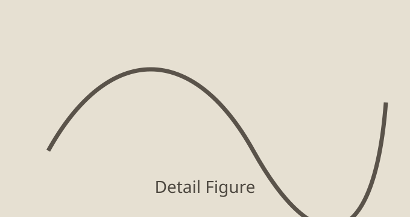

This page is a rendering check for the post layout. It covers images, quotes, code blocks, embeds, and math.

## Image rendering

The first figure is here to make sure image sizing, spacing, and captions behave normally.

<figure>
  
  <figcaption>Figure 1. Two-panel placeholder image for checking width and spacing around figures.</figcaption>
</figure>

Here is a second image to make sure the page still reads cleanly after a figure:



## Block quote styling

> This is a block quote

## Code block rendering

```js
function summarizePost(post) {
  const words = post.split(/\s+/).filter(Boolean).length;
  const readingMinutes = Math.max(1, Math.round(words / 220));
  return { words, readingMinutes };
}

console.log(summarizePost("Clear writing is easier to debug."));
```

```css
.content {
  max-width: 46rem;
  line-height: 1.78;
}
```

## LaTeX rendering

Inline math should work: $e^{i\pi} + 1 = 0$.

Display math should also work:

$$
\nabla \cdot \vec{E} = \frac{\rho}{\varepsilon_0}
$$

And one more expression for spacing checks:

$$
\operatorname*{arg\,min}_{\theta} \sum_{i=1}^{n} \left(y_i - f_\theta(x_i)\right)^2
$$

## Embed rendering

The iframe below is a rendering test for embedded media behavior and responsive scaling:

<iframe
  src="https://www.youtube-nocookie.com/embed/dQw4w9WgXcQ"
  title="Embedded video rendering test"
  loading="lazy"
  allow="accelerometer; autoplay; clipboard-write; encrypted-media; gyroscope; picture-in-picture; web-share"
  allowfullscreen
></iframe>

## Final checklist

- Images render from local post assets.
- Code blocks preserve formatting and horizontal scroll behavior.
- Block quotes are distinct without drawing too much attention.
- Inline and display LaTeX are rendered correctly.
- Iframe embeds render and remain responsive.
