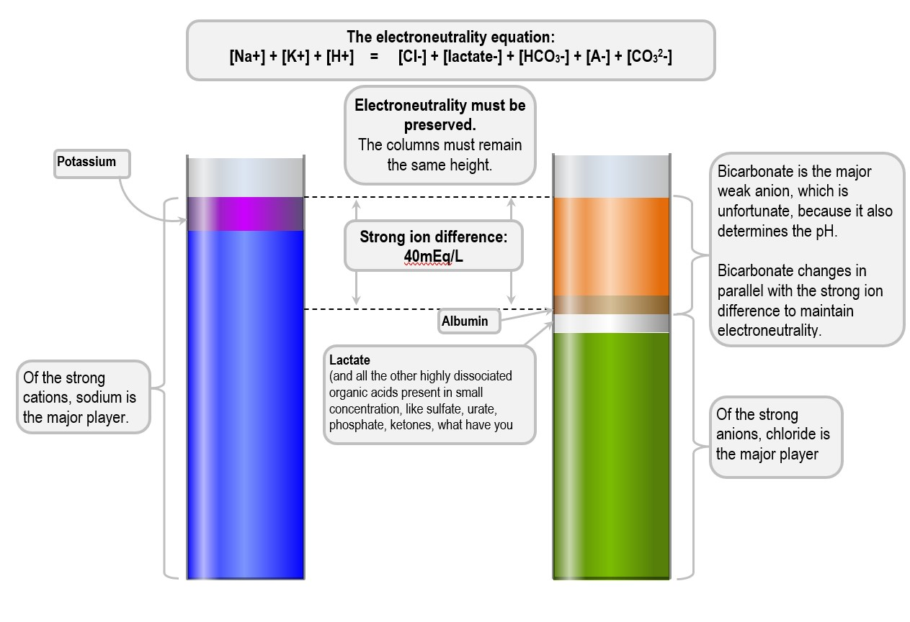

# The anion gap was too complicated, so we're computing the Hessian of the electroneutrality equation to prove acid-base physiology is componentwise-linear

The anion gap annoys me. Working through the anion gap approach to acid base feels like reciting a series of incantations in a language I don't understand, doing a ritual dance in front of an alien god, and praying that at the end I'll get to a number that my attending will think makes sense. 

Why do we use this particular formula for the anion gap? Who came up with it? Why is the standard range what it is? Then there are all the adjuncts that people bolt onto this in order to justify it. Winters' formula? Albumin correction? Delta gap? Delta ratio? Delta delta? Lactate adjustment? This is no way to live. 

I wanted a way to think about acids, bases, anions, and cations that didn't involve a series of cryptic additions of terms in a manner justified by the invocation of some name I was never going to remember. I wanted to start from first principle truths about how acids and bases and ions worked in the body, and mathematically _derive_ an understanding of acid-base physiology from that. 

Turns out I wasn't the first person to think about this, so here is a slightly more principled approach to acid base, unfortunately named after a Canadian^{Stewart, if you want spoilers. There are a lot of places describing the Stewart approach to acid-base, but I didn't see many that actually went through the algebra and the derivation. So here we are. I need to feel alive again so we're taking partial derivatives until our eyes bleed.}. 

## Blood has anions and cations 

Take your blood. It has cations -- the most famous of which are $\mathrm{Na}^+$, $\rm{K}^+$, $\rm{Mg}^{2+}$,  $\rm{Ca}^{2+}$, and $\rm{H}^+$. It also has anions, the most famous of which is $\rm{Cl}^-$. However, these anions are a little more complicated in that you also have a bunch of weak acids floating around -- the most prevalent of which are albumin and $\rm{PO}_4^{3-}$ -- which are sometimes anions, and sometimes not. We'll take all the non-bicarb weak acids and lump 'em all' together as $\rm{A}$. 

Let's start by defining some of the variables we care about. Let: 
$$
\begin{align*}
h &= [\rm{H}]^+ \\
s &= [\rm{Na}^+] + [\rm{K}^+] + 2 \cdot [\rm{Mg}^{2+}] + 2 \cdot [\rm{Ca}^{2+}] - [\rm{Cl}^-] \\
c &= \rm{pCO_2}
\end{align*}
$$
where $s$ is also sometimes called the _Strong Ion Difference_, or SID -- the difference between the anions and cations. 

Then, looking at water and carbon dioxide, we let
$$
\begin{aligned}
w &= [OH^-], \\
b &= [HCO_3^-], \\
x &= [CO_3^{2-}],
\end{aligned}
$$
Last, for our weak acids, which we're conveniently globbing together as $\rm{A}$, we have
$$
\begin{align*}
\rm{HA} &\rightleftharpoons \rm{H}^+ + \rm{A}^- \\
A &= [\rm{HA}] + [\rm{A}^-]
\end{align*}
$$
Thus far, this is all just notation. We've made no claims, we've just slapped letters on things to make our lives a bit easier down the line. 
## Acids and bases in blood are at equilibrium, mostly

We'll now define some equilibria^{Undergrad chemistry strikes again!}. Apologies in advance. 

First, water dissociation^{This is how we get the pH}:
$$
\begin{align*}
\rm{H_2O} &\rightleftharpoons \rm{H}^+ + \rm{OH}^- \\ 
k_w &= [\rm{H}^+][\rm{OH}^-] = hw \\
\end{align*}
$$

Second, carbon dioxide hydration^{Connecting the pCO$_2$ and bicarb, absorbing in the process an aqueous solubility coefficient which we will not deign to notate}:
$$
\begin{align*}
\rm{CO_2} + \rm{H_2O} \rightleftharpoons \rm{H}^+ + \rm{HCO_3}^- \\
k_c = \frac{[\rm{H}^+][\rm{HCO_3}^-]}{\rm{CO_2}} = \frac{hb}{c}
\end{align*}
$$

Third, bicarbonate dissociation^{Since bicarb can also act as an acid}:
$$
\begin{align*}
\rm{HCO_3}^- \rightleftharpoons \rm{H}^+ + \rm{CO_3}^{2-} \\
k_b = \frac{[\rm{H}^+][\rm{CO_3}^{2-}]}{[\rm{HCO_3}^{-}]} = \frac{hx}{b}
\end{align*}
$$
Fourth, weak acid dissociation^{Think albumin, phosphate, and all the other weak acids that doctors are too tired to list out}: 
$$\begin{align*}
\rm{HA} &\rightleftharpoons \rm{H}^+ + \rm{A}^- \\
k_a &= \frac{[\rm{H}^+][\rm{A}^-]}{[\rm{HA}]} \\
\end{align*}$$
which gives us^{Of note, we're modeling these weak acids with 1 titratable ionization spot, but this isn't actually the case. Albumin has tons of histidine residues that do the hokey pokey, and phosphate has generally 1-2 hydrogen ions it can shed in a pinch. However, this makes doing the math by hand a bit more difficult. The simplification here makes notation easy, but in principle you could play this game with the full setup. }
$$
\begin{align*}
\rm{A} &= [\rm{HA}] + [\rm{A}^-] \\
h[\rm{A}^-] &= k_a[\rm{HA}]
\end{align*}
$$

## The principle of electroneutrality

This is the secret sauce. In situations of e.g. metabolic or respiratory acidosis, what we observe are changes in the distributions of anions and cations. But, no matter what, the total charge of anions and total charge of cations has to be $0$ -- you can't be wandering around with a net positive charge in your blood, else we'd all be little^{Or very big, depending on how you think about things -- we probably wouldn't have very good energy efficiency} batteries. In equation form: 
$$
s + h - b - x - [\rm{A}^-] - w = 0
$$
In this equation $s + h$ is your strong cations minus your strong anions, and $b + x + [\rm{A}^-] + w$ is all of your weak anions. Strong anions plus weak anions has to equal strong cations. 

There are technically some weak cations, in the sense that $\rm{Mg}^{2+}$ and $\rm{Ca}^{2+}$ are partially ionized at physiologic pH, but given their relatively small concentration compared to $\rm{Na}$ we can pretty reasonably ignore this^{Though with the magic of computers, we don't have to! More on that down below.}. 

Solving our earlier equations for the variables in the electroneutrality equations gives us 
$$
\begin{align*}
b &= k_c \cdot c/h \\ 
x &= k_b \cdot b/h \\ 
  &= \frac{k_b k_cc}{h^2} \\
w &= k_w / h \\ 
\end{align*} 
$$

For $A$, we have to do a bit more gymnastics: 
$$
\begin{align*}
[\rm{A}^-] &= \frac{k_a}{h} [\rm{HA}] \\ ~ \\ 
\rm{A} &= [\rm{HA}] + [\rm{A^-}] \\
&= [\rm{HA}] + \frac{k_a}{h}[\rm{HA}] \\
&= [\rm{HA}] \left( 1 + \frac{k_a}{h} \right) \\ ~ \\ 
[\rm{HA}] &= \frac{\rm{A}}{\left( 1 + \frac{k_a}{h} \right)} \\
&= \frac{Ah}{h + k_a} \\ ~ \\ 
[\rm{A}^-] &= \frac{k_a}{h} [\rm{HA}] \\ 
&= \frac{k_a}{h} \cdot \frac{Ah}{h + k_a} \\
&= \frac{A \cdot k_a}{h + k_a}
\end{align*}
$$

Let's throw this all back into the electroneutrality equation: 
$$\begin{align*}
s + h - b - x - [\rm{A}^-] - w & = 0 \\ 
s + h - k_c \cdot \frac{c}{h} - \frac{k_b k_cc}{h^2} - \frac{A \cdot k_a}{h + k_a} - \frac{k_w}{h} &= 0 \\
h^2(k_a + h) \cdot \left(s + h - k_c \cdot \frac{c}{h} - \frac{k_b k_cc}{h^2} - \frac{A \cdot k_a}{h + k_a} - \frac{k_w}{h}\right) &= 0 \\
\end{align*}$$
Expanding this minor monstrosity out, grouping terms, and calling this a function $F$ gives you^{I promise I worked this out once on the back of a patient list}: 
$$\begin{align*}
F(h, s, c, A) = h^4 &+ (s + k_a) \cdot h^3 \\
					&+ (k_a s - k_c c - k_a A - k_w) h^2 \\
					&- (k_a k_c c + k_b k_c c + k_a k_w)\cdot h \\
					&- k_a k_b k_c c \\
					= 0
\end{align*}$$
where the parameters of the function are the pH, SID, pCO$_2$, and total weak acid. Importantly, $F(h, s, c, A) = 0$ for physiologically valid sets of $h, s, c, A$^{More or less, where they are all greater than 0 and $h \approx 10^{-7.4}$}.  

Then, solving for $h$ gives you the pH of the system (blood/plasma) as a function of the strong ion difference, pCO$_2$, and total weak acids. 

This approach was developed by Canadian physiologist Peter Stewart, who hallucinated this algebraic torture in the early 1980s. The idea is to focus on 3 independent variables: the difference between strong cations and anions (strong ion difference), the pCO$_2$, and the total weak acid amount (albumin and phosphate, mostly). 

## The strategic stacked bar chart reserve

Importantly, look at what we _aren't_ directly using as a variable that affects the pH -- the bicarbonate. Under this approach, the bicarb is actually a _result_ of all of the other stuff -- the strong ion difference, the pCO$_2$, and the other weak acids. The value of the bicarb is just whatever it needs to be for the whole system to play nice -- it's the _dependent_ variable, not the independent one^{You can also see this from the fact that the bicarb is directly computable from these parameters as $k_c c / h$.}. In other words, bicarb and pH are linked by an equilibrium -- and if we think of pH as the dependent variable, the result of a bunch of other processes (which we do) -- then why should bicarb be any different? 

You may be wondering why anyone would want to use this approach. Beyond the fact that it can make one feel smart^{Don't underestimate this} and that it gives you a certain condescension budget which you can spend liberally on rounds^{So long as you avoid depleting the strategic parentheses reserve, that would get the LISPers mad}, it can help in a few particular scenarios where it is more useful to think about anion-cation balance than acid-base status: 

1. You don't have to deal with an empiric formula derived from who knows where^{Someone probably knows from where} to figure out what to do with albumin or how to correct for it. Less albumin = less weak acid, which directly leads to higher bicarb to fill in the gap. 
2. Contraction alkaloses become a lot simpler -- you give someone truckloads of furosemide, you lose a proportionally larger amount of chloride than sodium^{The NKCC channels inhibited by loop diuretics move 2 chlorides for 1 sodium and 1 potassium}, bicarb expands to fill in the gap and maintain electroneutrality. 
3. Giving someone a large amount of normal saline induces a hyperchloremic acidosis -- you give them more chloride than is present in serum, so chloride goes up, so bicarb drops/gets squeezed out to keep things neutral. 

We can visualize this acid/base balance using a Gamblegram^{Named after physiologist James Gamble, who will hopefully become the topic of a future blog post}, which maps out anions and cations on a pair of stacked bar charts: 
<figure>
  
  <figcaption>Example Gamblegram with some annotations, taken from <a href=https://derangedphysiology.com/main/cicm-primary-exam/acid-base-physiology/Chapter-501/strong-ion-difference-normal-anion-gap-acidosis>here</a></figcaption>
</figure>

The idea here is that instead of computing a series of quantities and looking at what fits in what arbitrary reference range, you can _directly examine_ the anion-cation balance and see what's out of whack. Are there a bunch of anions -- for example, lactate or $\beta$-hydroxybutyrate -- that are squeezing out the bicarb? Is the chloride way too low since we over-diuresed someone, and bicarb had to expand to fill in the gap? Is there zero albumin, and so something's gotta make up the difference? Did we flood someone with normal saline, send their chloride flying up to the sky, and then the bicarb had to go run away because there was no more space in the Gamblegram? 

This turns mysterious acid-base problems with various formulae and corrections into very concrete (and simple) questions about the balance between anions and cations -- and, to me, this is a much easier frame to reason about. Anions minus cations equals zero. Everything else is just bonus. 

If you want to be able to build a lil Gamblegram on the fly at the bedside there are a number of apps and websites that do it. For much of my intern year I used [https://medischesnippers.nl/stewart/](https://medischesnippers.nl/stewart/), and then I built [https://axmukund.github.io/stewart/](https://axmukund.github.io/stewart/) when UCSF briefly forgot to rate-limit the enterprise OpenAI account they gave us. They didn't forget for very long. 

The physicochemical calculator on my page does some fancy stuff to estimate ionized magnesium and calcium, uses per-residue models of albumin protonation and a full triprotic approximation of phosphate ionization, and lets you do fun things like use the BMP bicarb for the Gamblegram instead of using the inferred bicarb off a blood gas. But enough about that. 

All this said, clinically speaking, the debate between the traditional approach -- base excess, anion gap -- and the physicochemical approach is largely academic. Assuming you work through all the relevant steps appropriately, you will get to the correct conclusion with either approach. However, only one has ["intoxicating mathematical integrity"](https://derangedphysiology.com/main/cicm-primary-exam/acid-base-physiology/Chapter-501/strong-ion-difference-normal-anion-gap-acidosis). 

## Derivatives of the Stewart model

Ha, no, not those derivatives^{Though don't worry, Figge/Fencl/Story will get their own time in the limelight}. We now have a function $F(h, s, c, A): \mathbb{R}^4 \to \mathbb{R}$. We write $F$ as before:
$$
\begin{align*}
F(h, s, c, A) = h^4 &+ (s + k_a) \cdot h^3 \\
					&+ (k_a s - k_c c - k_a A - k_w) h^2 \\
					&- (k_a k_c c + k_b k_c c + k_a k_w)\cdot h \\
					&- k_a k_b k_c c \\
\end{align*}
$$
### The Jacobian

The Jacobian $\nabla F$ can be written as: 
$$
\nabla F = \left(\frac{\partial F}{\partial h}, \frac{\partial F}{\partial s}, \frac{\partial F}{\partial c}, \frac{\partial F}{\partial A}\right)
$$
where 
$$
\begin{align*}
\frac{\partial F}{\partial h} &= \frac{\partial}{\partial h} \left(
h^4 + (s + k_a) \cdot h^3
					+ (k_a s - k_c c - k_a A - k_w) h^2 
					- (k_a k_c c + k_b k_c c + k_a k_w)\cdot h 
					- k_a k_b k_c c 
\right) \\
&= 4h^3 + 3(s + k_a)h^2 + 2(k_a s - k_c c - k_a A - k_w)h - k_a k_c c - k_b k_c c - k_a k_w \\
&= 4h^3 + 3(s + k_a)h^2 + 2(k_a s - k_c c - k_a A - k_w)h - (k_a+k_b) k_c c - k_a k_w
\end{align*}
$$
and 
$$
\begin{align*}
\frac{\partial F}{\partial s} &= h^3 + k_a h^2 = h^2(h + k_a) \\ ~ \\
\frac{\partial F}{\partial c} &= -h^2k_c - h (k_a k_c + k_b k_c) - k_a k_b k_c \\
							  &= -k_c(h^2 + h(k_a + k_b) + k_a k_b) \\
							  &= -k_c(h+k_a)(h+k_b) \\ ~ \\
\frac{\partial F}{\partial A} &= -h^2k_a
\end{align*}
$$ 
We then work with the implicit function $h(s, c, A)$ after assuming (not unreasonably) $F(h, s, c, A) = 0$. By the implicit function theorem^{Here, the idea being that $\partial h / \partial s = -(\partial F / \partial s) / (\partial F / \partial h)$ and so on and so forth}, we have: 
$$
\begin{align*}
\frac{\partial h}{\partial s} &= -\frac{h^2 (h + k_a)}{F_h} \\ 
\frac{\partial h}{\partial c} &= \frac{k_c(h+k_a)(h+k_b)}{F_h} \\
\frac{\partial h}{\partial A} &= -\frac{h^2k_a}{F_h}
\end{align*}
$$
where $F_h = \partial F / \partial h$, which is too unwieldy to fully expand each time. 

Off the bat, this gives you a) that raising the albumin and/or pCO$_2$ drops the ph ($\partial h/\partial A > 0,\ \partial h/\partial c > 0$); b) that raising the strong ion difference increases the pH ($\partial h / \partial s < 0$); and c) the effect of these changes changes as the pH changes. 

Additionally, because these first order partial derivatives never change their sign^{assuming $F_h \ne 0$ and does not change sign, which is true in physiological regimes}, the effects of the perturbations won't flip about. As you increase the SID, the pH won't start to go up and then all of a sudden start going down -- effects are **directionally stable**. 

### The Hessian

The entries of the Hessian matrix $H$ are defined as $H_{ij} = \partial_i \partial_j F$^{It's worth noting that because $F \in C^{\infty}$, $H_{ij} = H_{ji}$ -- this is from [Clairaut's theorem/Schwarz's theorem](https://en.wikipedia.org/wiki/Symmetry_of_second_derivatives)}. Let's write them out^{This was easily my least favorite part of linear algebra. I hate doing this kind of accounting. I'm no good at it. I hate it.}: 

$$ 
\begin{align*}
\partial_h \partial_h F &= 12h^2 + 6h(s + k_a) + 2(k_a s - k_c c - k_a A - k_w) \\ ~ \\ 
\partial_h \partial_s F &= 3h^2 + 2 k_a h \\ 
					    &= h(3h + 2k_a) \\ ~ \\
					    
\partial_h \partial_c F &= -2k_c h - (k_a+k_b) k_c \\
						&= -k_c(2h + k_a + k_b)\\ ~ \\

\partial_h \partial_A F &= -2k_a h
\end{align*}
$$

If you squint, you'll note that all the other entries of the Hessian are zero, since the other first order partial derivatives solely depend on $h$. Mixed second derivatives with respect to the other variables are $0$ since $F$ is independently linear^{more specifically, affine-linear, but we'll get to that in a second} in $s, A, c$. 

So if you hold $s$ and $A$ constant, $F$ is linear in $c$. But, the _coefficients_ of $F$ with respect to $c$ are actually affected by $s$ and $A$, because of nonlinearity that enters through $h$. Let's take, for example:
$$
\begin{align*}
\frac{\partial^2h}{\partial s \partial c} &= \frac{\partial}{\partial c} \left(- \frac{\partial F / \partial s}{\partial F / \partial h}\right) \\ 
&= \frac{\partial}{\partial c} \left(- \frac{F_s}{F_h}\right) \\
&= \frac{\partial}{\partial c} \left(- \frac{h^2(h + k_a)}{F_h}\right)
\end{align*}
$$

Even though $F_{sc} = 0$, $h$ depends on $c$ ($[\rm{H}^+]$ is affected by pCO$_2$) and $F_s = h^2 (h + k_a)$ depends on $h$. This is to say, all of the variables we see are coupled through $h$, which means that  $h$ is not strictly linear in $s, A, c$. So, the effects of the SID, pCO$_2$, and weak acids are not strictly independent, though they can be thought of as locally linear if the pH doesn't change too much^{In practice, because of things like renal compensation, intracellular shifts, nonlinear protein buffering with e.g. albumin, there is actually some additional nonlinearity in the system. However, the system is "close enough" to linear within small neighborhoods that this approximation method is more or less on the money.}. 

Stated alternately, the net effect we see with small perturbations can be reasonably well-approximated by the _sum_ of the individual effects of the pCO$_2$, the weak acids, and the strong ion difference. More formally, the system permits a relatively accurate first-order Taylor approximation that decomposes acid-base disturbances into separable effects of the SID, the amount of weak acid, and the respiratory/pCO$_2$ component. 

## TL;DR

[Check this lil calculator out](https://axmukund.github.io/stewart/) 